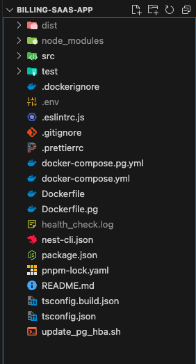

## **Simple Billing App for a SaaS Platform**

## **Schema Design:**

### 1. Customer Table

- `id`: Primary Key, unique identifier for each customer. This is essential for uniquely identifying customer records across the database.
- `name`: Name of the customer. This is important for personalization and communication purposes.
- `email`: Customer's email address. This is critical for communication, login identification, and password resets.
- `created_at`: Timestamp of when the customer record was created. This helps in tracking when the customer joined the service.
- `updated_at`: Timestamp of the last update made to the customer's record. Useful for auditing changes.
- `subscriptionPlanId`: Foreign key linked to the SubscriptionPlan table. It determines which plan the customer is currently subscribed to.
- `subscription_status`: Status of the customer's subscription (e.g., active, canceled, pending). Useful for managing access to services and billing.
- `subscription_start_date`: This field represents the date when the customer’s subscription begins.
- `subscription_end_date`: This field indicates the date when the customer’s current subscription period will end
- `last_payment_date`: Date of the last payment. This helps in determining billing cycles and delinquency.

### 2. SubscriptionPlan Table

- `id`: Primary Key, unique identifier for each subscription plan.
- `name`: Descriptive name of the plan (e.g., Basic, Pro, Enterprise). Helps customers understand the tier of service.
- `price`: Monthly price of the subscription plan. Necessary for billing purposes.
- `duration`: Duration of the subscription plan (typically in months). Useful for determining when the subscription renews or expires.
- `billing_cycle`: This field defines how often the customer is billed for the subscription plan. This is crucial for setting up automated billing, invoice generation, and subscription management
- `status`: Status of the plan (active/inactive). Helps manage availability of the plan for new or upgrading customers.
- `features`: Description of features provided in the plan. Useful for sales and customer support to explain plan capabilities.

### 3. Invoice Table

- `id`: Primary Key, unique identifier for each invoice.
- `customerId`: Foreign key linked to the Customer table. Identifies the customer to whom the invoice is issued.
- `subscriptionPlanId`: Foreign key linked to the SubscriptionPlan table. Details the plan for which the invoice is issued.
- `amount`: Total amount charged on the invoice. Necessary for financial records and customer billing.
- `issue_date`: Date when the invoice is issued.
- `due_date`: Date by which the payment should be made. Important for reminding customers and managing collections.
- `payment_date`: Date when the payment was received. Useful for reconciling accounts and managing cash flow.
- `status`: Status of the invoice (e.g., paid, unpaid, overdue). Key for tracking the payment lifecycle.

### 4. Payment Table

- `id`: Primary Key, unique identifier for each payment.
- `invoiceId`: Foreign key linked to the Invoice table. Ensures that the payment is correctly associated with an invoice.
- `amount`: Amount paid. This should match the invoice amount or part of it if the payment is partial.
- `payment_date`: Timestamp of when the payment was made. Critical for financial records.
- `payment_method`: Method of payment (e.g., credit card, PayPal, bank transfer). Important for processing and reconciliation.
- `status`: Status of the payment (e.g., successful, failed, pending). Helps in managing payment processing and troubleshooting.

## **Step-by-Step Guide to Setting Up Your SaaS Billing Platform**

### Step # 1 : Installing Docker and Docker Compose:

Start by downloading Docker, which includes Docker Compose as part of its desktop installation for Windows and Mac. For Linux users, Docker Compose must be installed separately. This setup will enable you to manage containerized applications smoothly. Visit the official Docker website to download the appropriate installer for your operating system and follow the provided installation instructions to set up both Docker and Docker Compose.

### Step # 2 : Clone the Billing SaaS Application Repository:

This step involves cloning your SaaS billing application from its GitHub repository.

[https://github.com/tahakhan-dev/billing-saas-app.git](https://github.com/tahakhan-dev/billing-saas-app.git)

### Step # 3: Navigate to the Project's Root Directory:

After cloning the repository, switch to the project's root folder to begin configuration and setup.



### Step # 4: Set Environment Variables for Docker Compose

Configure the required environment variables to ensure the Docker Compose setup runs correctly.

```jsx
PORT=3000
CLUSTER_ENV=dev

#----- Database Credential------------------
DB_HOST=host.docker.internal
DB_PORT=5433
DB_USER=tahakhan
DB_PASSWORD=
DB_DATABASE=postgres
DB_TYPE=postgres
ENABLE_AUTOMATIC_CREATION=true
AUTO_LOAD_ENTITIES=true

JWT_SECRET=6502f2502a8b22bbbd724cd4efedcbe7fbdf47410cbb385e69c6494bcc107ea7

# ----------- EMAIL CREDENTIAL --------------------

SMTP_HOST=smtp.example.com
EMAIL_USER=user
EMAIL_PASSWORD=your-email-password
SENDER_ADDRESS=send-email-address
```

### Step # 5: Launch PostgreSQL with Docker Compose

This docker-compose.pg.yml file will set up a PostgreSQL container and automatically create the necessary databases. To automate this process, I've implemented a shell script.

```jsx
docker-compose -f docker-compose.pg.yml up -d
```

### Step # 6: Execute Docker Compose to Start the SaaS Billing Application

Use Docker Compose to launch your SaaS billing application, initializing all necessary services defined in the `docker-compose.yml` file.

```jsx
docker-compose  up -d && docker-compose logs -f
```


### Access API Documentation:

Visit `http://localhost:3000/api_docs` to view the API documentation for the SaaS billing application.


